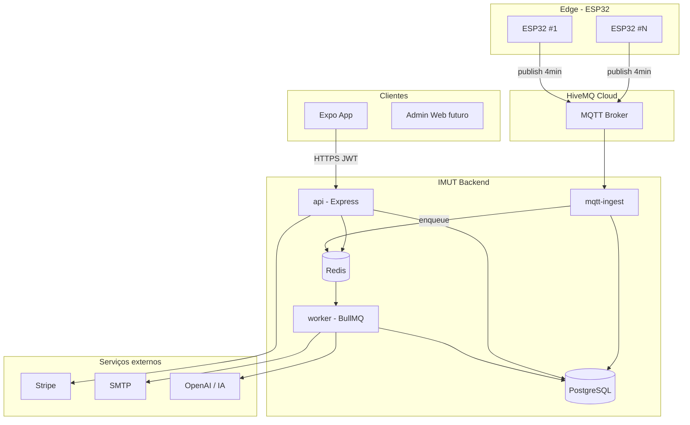

# Arquitetura IMUT

## Visão geral

O IMUT é um SaaS multi-tenant: cada **organização** (cliente pagante) possui ambientes, sensores ESP32, responsáveis e assinatura Stripe. O fluxo de dados IoT é desacoplado da API HTTP via MQTT e filas assíncronas.



## Limites do produto

| Recurso | Limite |
|---------|--------|
| ESP32 por organização | 10 |
| Intervalo de medição | 4 min (240 s) |
| Responsáveis por organização | 5 |
| Métricas por leitura | temperatura °C, umidade % |
| Acesso sem assinatura ativa | bloqueado (exceto billing/login) |

## Camadas

### 1. Dispositivos (ESP32)

- Publicam JSON no tópico MQTT: `imut/{orgId}/{deviceId}/telemetry`
- Payload exemplo: `{ "temp": 22.5, "humidity": 65, "ts": 1716566400 }`
- Credenciais por dispositivo (username/password HiveMQ ou certificado)
- Firmware valida Wi-Fi e reconecta ao broker

### 2. Ingestão MQTT (`services/mqtt-ingest`)

- Conexão persistente ao HiveMQ Cloud (TLS)
- Valida tópico e `deviceId` cadastrado no Prisma
- Descarta leituras de org sem assinatura `ACTIVE`
- Persiste `Reading` e enfileira job `process-reading` no BullMQ
- Rate: ~150 leituras/hora/org (10 devices × 15/h)

### 3. API REST (`apps/api`)

Responsabilidades:

- Autenticação JWT (register, login, refresh, logout)
- CRUD organização, ambientes, dispositivos, responsáveis
- Webhooks Stripe (`customer.subscription.*`)
- Consulta histórico, alertas, dashboard aggregates
- Dispara jobs manuais (reprocessar relatório) — admin only

**Não** processa telemetria em tempo real no request cycle — isso fica no worker.

### 4. Workers (`services/worker`)

Filas BullMQ (Redis):

| Fila | Job | Trigger |
|------|-----|---------|
| `telemetry` | `process-reading` | Cada leitura MQTT |
| `alerts` | `evaluate-anomaly` | Após process-reading se regras batem |
| `notifications` | `send-alert-email` | Alerta criado |
| `reports` | `weekly-report` | Cron: domingo 08:00 TZ org |
| `ai` | `analyze-environment` | Após weekly-report ou spike |

### 5. IA

Pipeline por ambiente (últimos 7 dias de leituras):

1. **Detecção de anomalias** — desvio vs média móvel + limiar configurável
2. **Predição** — tendência linear / suavização para próximas 24h (alerta preventivo)
3. **Relatório semanal** — LLM gera resumo em PT-BR + recomendações

Resultados em `AiInsight` (JSON estruturado + texto).

### 6. Mobile (`apps/mobile`)

- Expo Router, NativeWind
- Auth: secure store para refresh token
- Telas: login, assinatura (Stripe Checkout deep link), dashboard, ambientes, alertas, responsáveis
- Push notifications (Expo) para alertas críticos — fase 2

### 7. Controle de acesso por pagamento

Middleware `requireActiveSubscription`:

```
Subscription.status IN (ACTIVE, TRIALING)
AND current_period_end > now()
```

Roles:

| Role | Permissões |
|------|------------|
| `OWNER` | billing, dispositivos, responsáveis, tudo |
| `ADMIN` | ambientes, alertas, relatórios |
| `VIEWER` | somente leitura |

Máximo 5 usuários com role ≠ OWNER por org (responsáveis).

## Modelo de dados (resumo)

Ver `apps/api/prisma/schema.prisma`.

Entidades principais: `Organization`, `User`, `Membership`, `Subscription`, `Environment`, `Device`, `Reading`, `Alert`, `WeeklyReport`, `AiInsight`.

## Segurança

- JWT access (15m) + refresh (7d) rotacionado
- Senhas bcrypt
- MQTT: ACL por `orgId` no HiveMQ
- Stripe webhooks com assinatura HMAC
- Rate limit na API (Redis)
- HTTPS terminado no Nginx

## Escalabilidade

- `mqtt-ingest` e `worker` horizontais (múltiplas instâncias, mesma fila Redis)
- Postgres: particionamento futuro de `Reading` por mês
- Leituras quentes em Redis (última temp por device) para dashboard rápido

## Referências

- [API REST](./API.md)
- [MQTT e tópicos](./MQTT.md)
- [Deploy Docker](./DEPLOYMENT.md)
